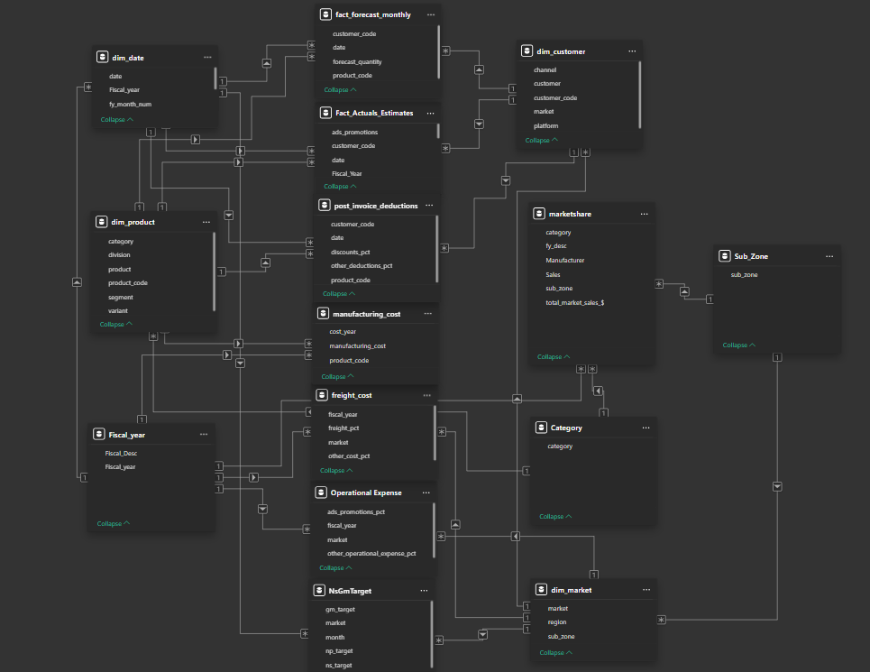
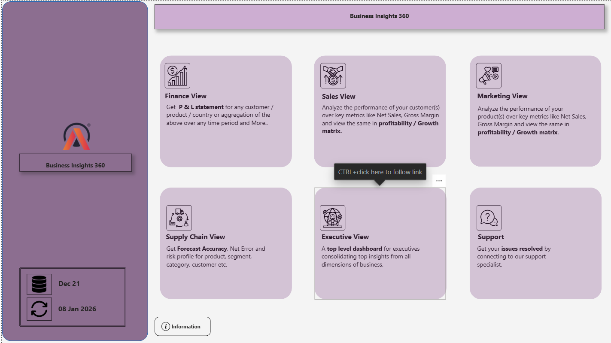
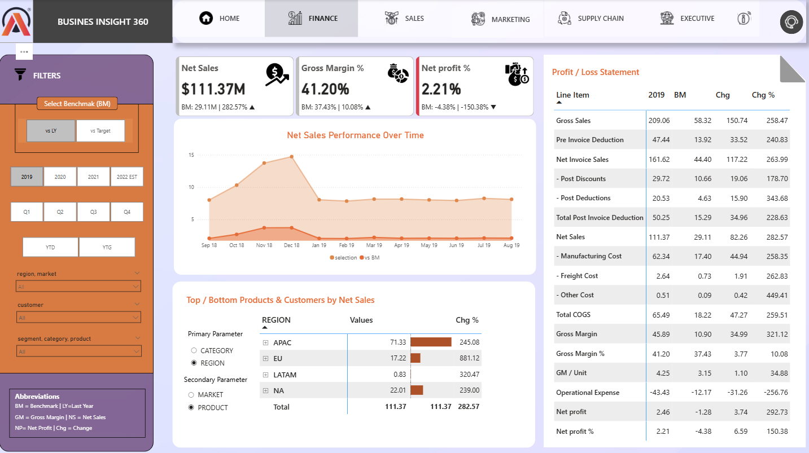
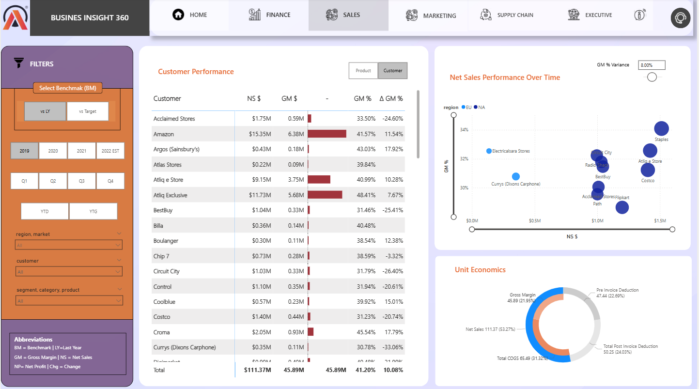
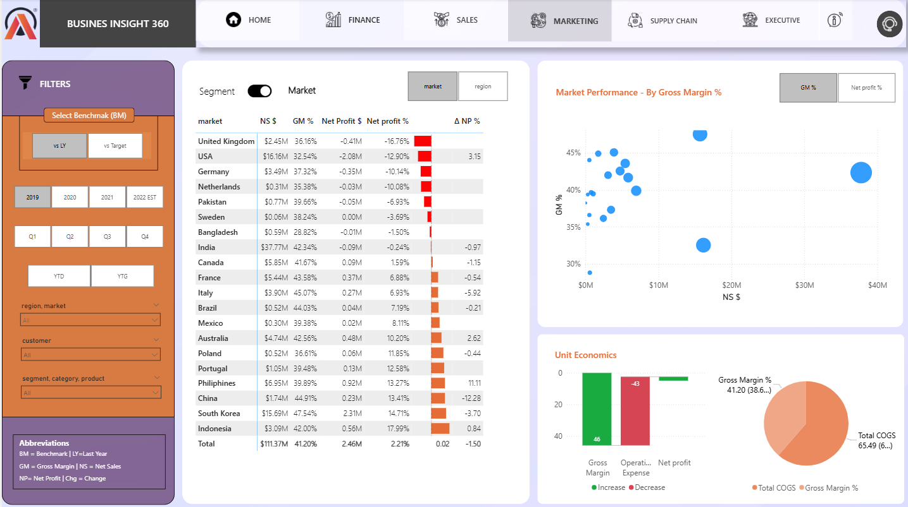
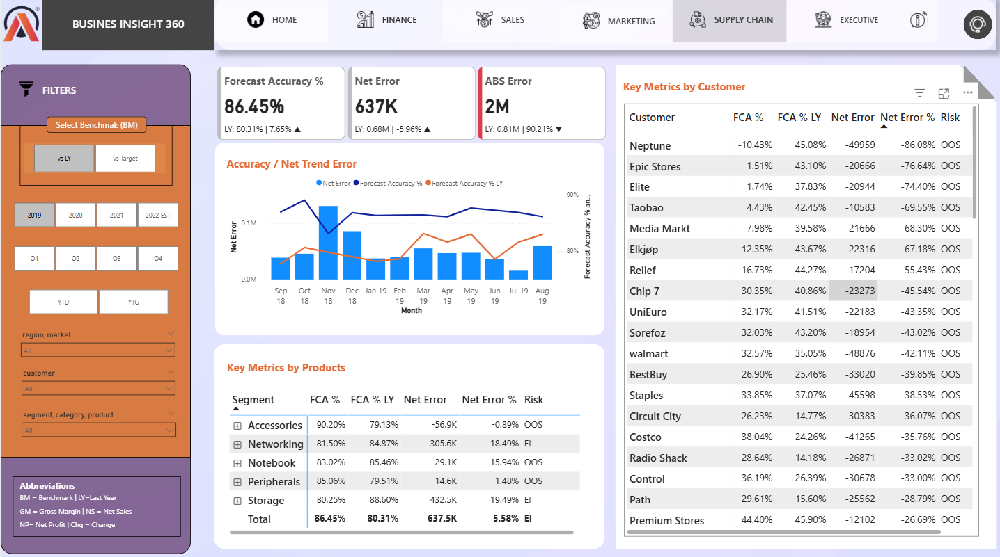
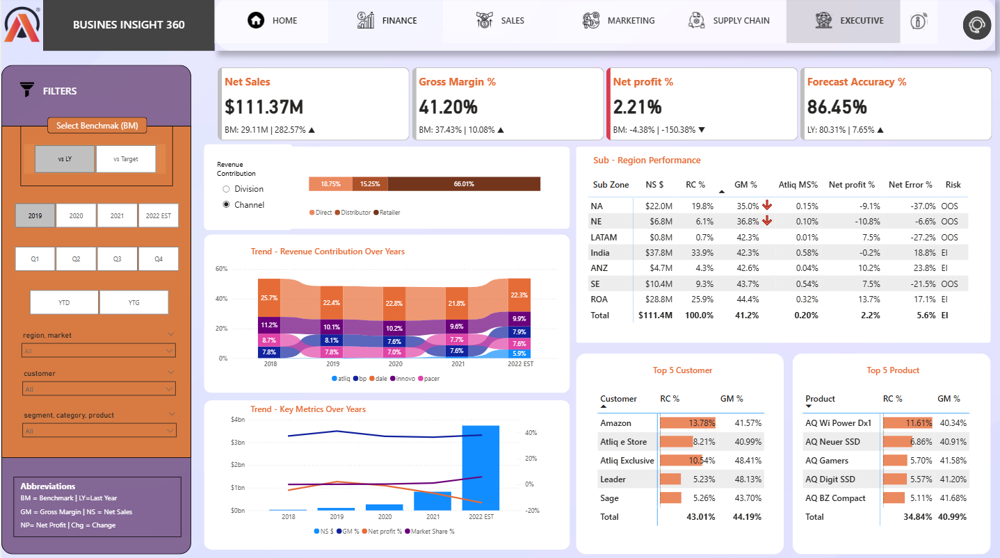

# Business Insights 360

## Project Overview

AtliQ Hardware is a fast-growing global company that sells computers and computer accessories. To move away from intuition-based decisions and stay competitive in the market, the company decided to implement **Power BI driven analytics** for the first time.

This project provides **end-to-end business insights** across key departments such as **Finance, Sales, Marketing, and Supply Chain**, helping stakeholders make **data-driven decisions**.

📌 Live Power BI report link is available in the repository description.

---

## Tech Stack

- MySQL  
- Power BI Desktop  
- Excel  
- DAX  
- DAX Studio  
- Project Charter Document  

---

## Power BI Skills Used

- Understanding business requirements before building dashboards  
- Creating calculated columns and measures using DAX  
- Designing efficient data models  
- Using bookmarks for visual switching  
- Page navigation with buttons  
- Preventing divide-by-zero errors using `DIVIDE()`  
- Creating date tables using Power Query (M Language)  
- Dynamic titles based on filters  
- KPI indicators and conditional formatting  
- Data validation techniques  
- Publishing reports to Power BI Service  
- Setting up personal gateway for auto-refresh  
- Creating Power BI Apps  
- Managing workspace access and sharing  

---

## GitHub Implementation

- Git LFS used to upload large Power BI files  
- File tracking configured based on specific file extensions  

---

## Business Concepts Covered

- Gross Price  
- Pre-Invoice Discount  
- Post-Invoice Discount  
- Net Invoice Sales  
- Gross Margin  
- Net Sales  
- Net Profit  
- COGS (Cost of Goods Sold)  
- YTD (Year to Date)  
- YTG (Year to Go)  
- Retailers  
- Direct Sales  
- Distributors  
- Consumers  

---

## Company Background

AtliQ Hardware operates globally and sells its products through:

- Retailers  
- Direct Sales  
- Distributors  

The company faced losses after expanding into the US market using manual analysis and intuition-based decisions. Meanwhile, competitors were using advanced analytics.  
To remain competitive, AtliQ decided to build a strong **data analytics system** using Power BI.

---

## Project Kick-off

Before starting the dashboard, stakeholder meetings were conducted to understand:

- Business objectives  
- Project success criteria  
- Timeline and delivery expectations  
- User requirements  
- Risks and limitations  
- Data and reporting needs  
- Dashboard design expectations  

---

## Dataset Overview

### Database: gdb041

**Dimension Tables**

- `dim_customer`  
  - 27 markets  
  - 75 customers  
  - 2 platforms (Physical Stores & E-commerce)  
  - 3 sales channels  

- `dim_market`  
  - 27 markets  
  - 7 sub-zones  
  - 4 regions (APAC, EU, LATAM, NA)  

- `dim_product`  
  - Divisions: P&A, PC, N&S  
  - 14 product categories  
  - Multiple product variants  

**Fact Tables**

- `fact_forecast_monthly` – Forecasted product demand  
- `fact_sales_monthly` – Actual sales quantity  

---

### Database: gdb056

- `freight_cost`  
- `gross_price`  
- `manufacturing_cost`  
- `pre_invoice_deductions`  
- `post_invoice_deductions`  

---

## Data Import

Data was imported from a **MySQL database** into Power BI using secure database credentials.

---

## Data Modeling

A **Snowflake Schema** was used to build a scalable and performance-optimized data model, following industry best practices.

---

## Dashboard Structure

The Home page allows navigation to different views:

- Finance  
- Sales  
- Marketing  
- Supply Chain  
- Executive
- Information
- Support  

---

## Report Pages

## Dashboard Preview

### Home

### Finance

### Sales

### Marketing

### Supply Chain

### Executive

Each view provides deep insights into its respective business function.

---

## Project Outcome

This dashboard enables AtliQ Hardware to:

- Track financial performance  
- Analyze customer and product trends  
- Improve inventory and supply planning  
- Support leadership with real-time insights  

Overall, it helps the company make **better, faster, and data-driven decisions**.

---
